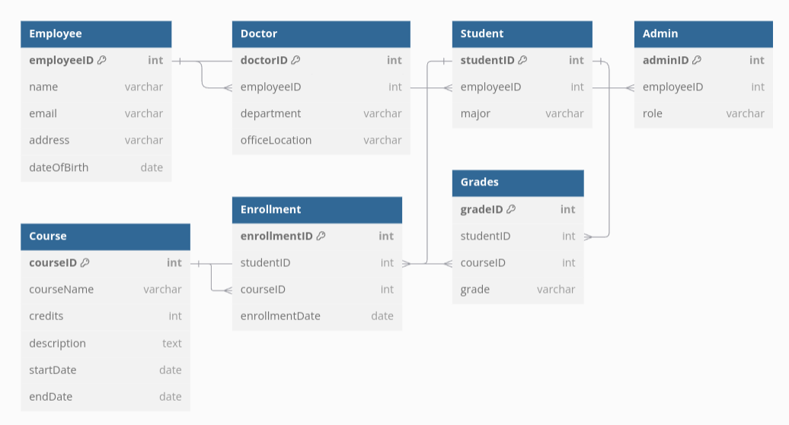
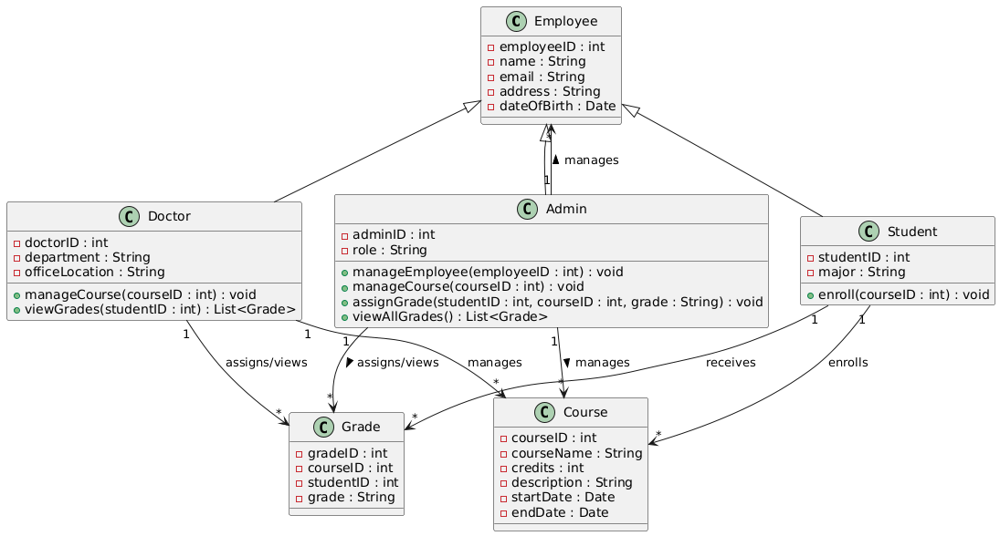
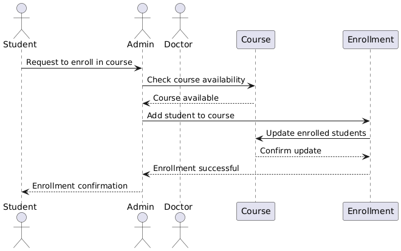
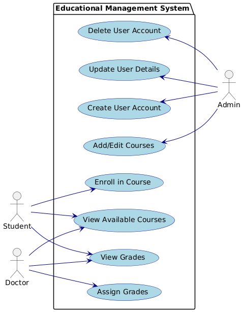

# Project Overview

Project Name: Educational Management System

This document outlines the Software Requirements Specification (SRS) for the Educational Management System. The following components provide detailed information on the system's structure, design, and flow.

---

## 1. Software Requirements Specification (SRS)

- SRS Document: [EducationalManagementSRS.pdf](EducationalMangmentSRS.pdf)

This document contains a comprehensive description of the system requirements, including functional and non-functional specifications, design constraints, system interfaces, and more.

---

## 2. Wireframe Design

- Wireframe: [Educational Management System Wireframe](https://www.figma.com/design/6lDyi99Gw6sy27VDtbFOB9/Untitled?node-id=0-1&p=f)

The wireframe provides a visual representation of the system's user interface (UI), showing the layout and functionality of the key pages.

---

## 3. Diagrams

### 3.1 Entity Relationship Diagram (ERD)

- ERD: 

The ERD shows the relationships between different entities in the system, representing the database structure and how data entities interact with each other.

---

### 3.2 Class Diagram

- Class Diagram: 

The class diagram outlines the system's classes and their relationships. It helps in understanding the object-oriented structure of the system and its components.

---

### 3.3 Sequence Diagram

- Sequence Diagram: 

The sequence diagram illustrates the interactions between different components of the system over time, depicting how the system processes various use cases step by step.

---

### 3.4 Use Case Diagram

- Use Case Diagram: 

The use case diagram visualizes the system’s functionality from the user's perspective, showing how different users (actors) interact with the system.

---

## Conclusion

This documentation provides a structured and professional overview of the Educational Management System project, including design elements and core system specifications.
